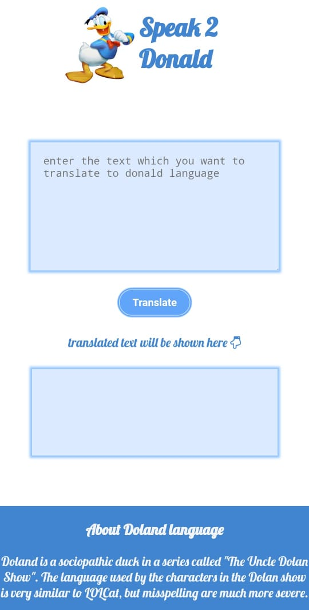

# Speak 2 Doland
This is a web application which translate english language into dolan language

# Motivation
The motivation behind creating this project is [neogcamp](https://neog.camp/)

# Visuals

# Tech used
* html
* css
* javascript

# Api Reference
To translate the english language to minion language funtranslation api is used
[here'the url](https://api.funtranslations.com/translate/minion.json
)

# Usage
* [Go to this link](https://poonammohata.github.io/Dolan-Translator/)
* enter your text on first input box
* click on translate button
* translated text will be shown in second box
